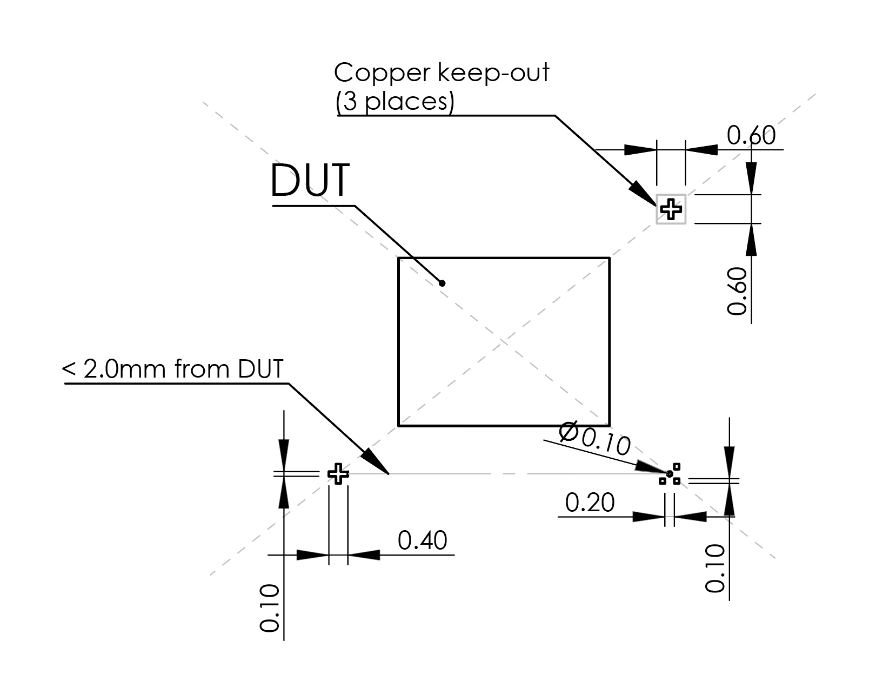
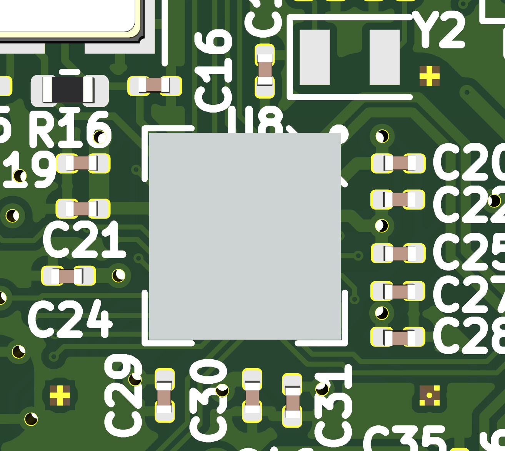
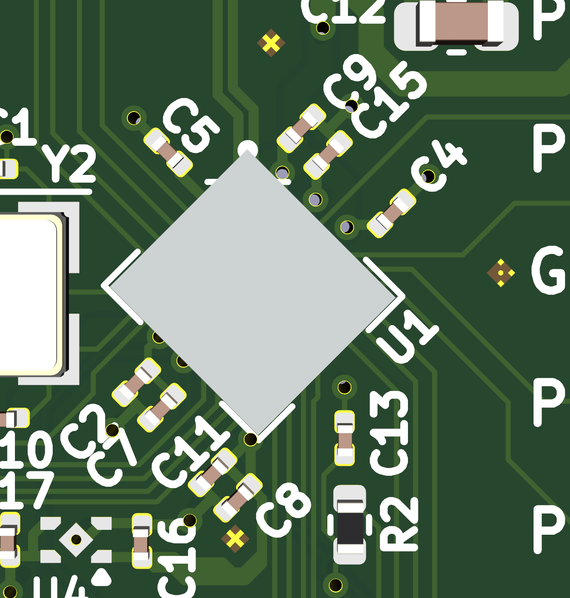
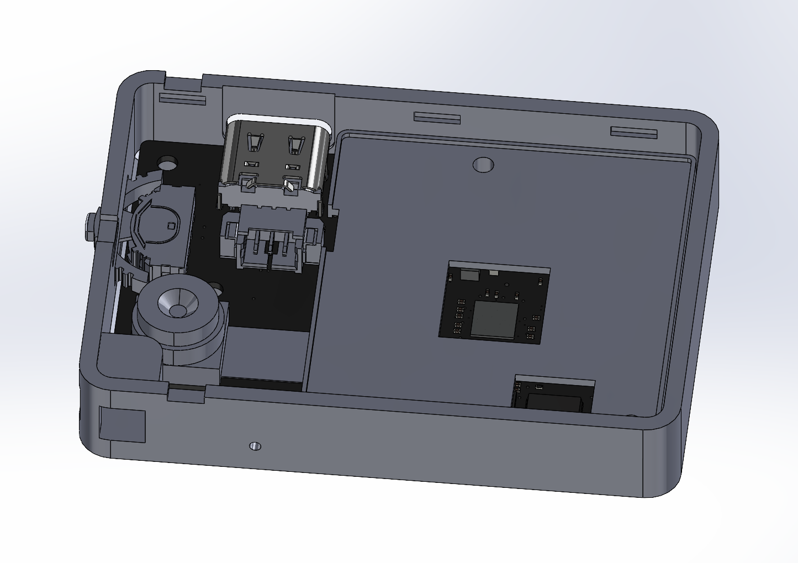
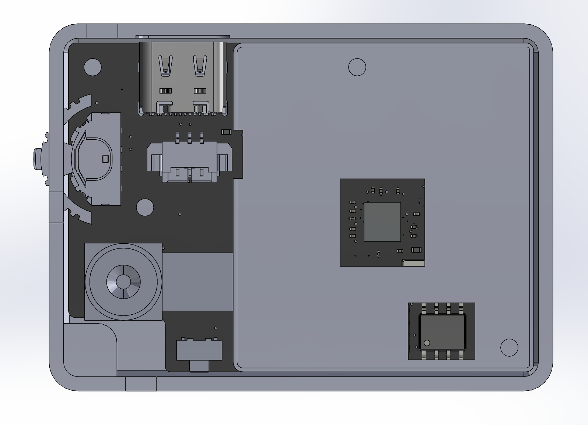
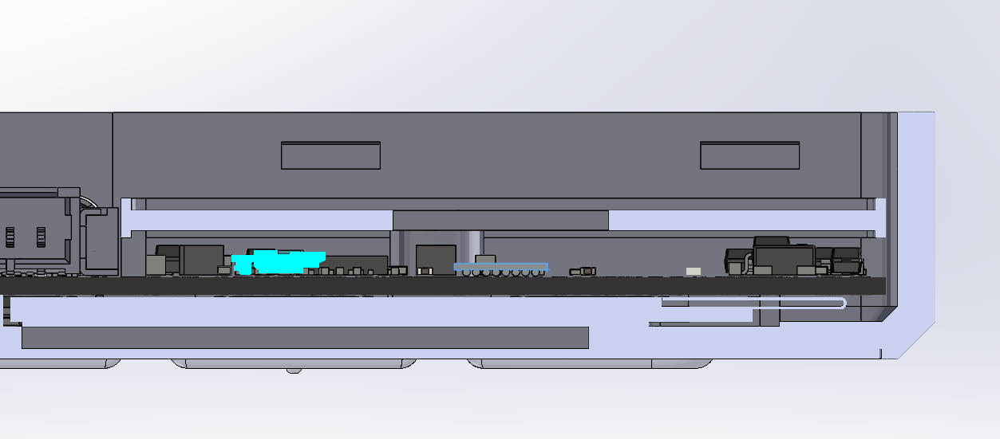

# System Specifications for IRIS

## Abstract

This document specifies the mechanical requirements for an assembled system to facilitate IRIS inspection.

## Status

This specification is informational to the Internet community. Distribution of this specification is unlimited.

Revision history:

* v1.0 - specification created (bunnie)

## Conventions Used in This Document

All dimensions are in millimeters unless otherwise specified.

## System Overview

A key feature of IRIS is the ability to inspect chips *in-situ*, that is, after they have been integrated into a system. "Point of use" inspection means that the final end user is also doing the inspection. While it may not always be practical for every user to personally inspect their devices, reducing the number of handling steps between the point of inspection and the end user correspondingly minimizes the number of actors involved in the chain of trust.

A system that is easy to inspect reduces the barrier between the point of inspection and the point of use. This document provides guidelines, specifications and best practices for systems looking to facilitate IRIS inspections.

## Optical Calibration & Alignment Fiducials

It is recommended to incorporate alignment fiducials into the top copper layer of any PCB designated for IRIS-inspectable systems. Alignment fiducials assist the computation of rotation and scale correction terms in machine vision operations. This is essential for high-resolution comparisons of the device under test (DUT) against reference images.

The fiducial shapes are also designed as auto-focus targets, allowing them to play a critical role for machines, such as [Jubiris](https://github.com/bunnie/iris-hw), that have the ability to correct for offsets in the imaging plane in three dimensions. Flatness correction is particularly important for high-power objectives, where the focus depth may be just a few microns.

Constructing the fiducials using the PCB copper layer leverages the relatively high consistency of modern PCB processes to create a standard ruler that is parallel to the plane of the chip. The alignment fiducials consist of three marks: two crosses, and a set of dots.

In addition to creating these copper patterns on the top layer of the PCB, designers should also pay attention to the following concerns:
- A copper keep-out is required around the fiducials. This prevents traces and fill zones from intruding into the recognition area.
- A solder mask pull back is recommended in the fiducial regions. However, this is not mandatory, as most soldermasks are virtually transparent in infrared wavelengths.
- No copper features should be routed underneath the fiducials. FR-4 dilectrics are translucent to infrared light. Any copper feature under the fiducial should be at least as wide as the fiducial itself.

The exact distance of the fiducials from the DUT edge is flexible. Once the fiducials are recognized, the system can be programmed with the implementation-specific distance required to dead-reckon from the fiducials to the chip itself. The hard limit is the safety envelope of the imaging head's movement, which is constrained to a few centimeters, but it makes the imaging setup faster if the fiducials are closer to the chip. Thus, placement within 2mm from the edge of the DUT is a good rule of thumb.

Regardless of the distance, the fiducials must remain symmetric along the diagonals of the DUT (dashed gray lines in the diagram above). Symmetry is required so that the center point of the DUT may be extracted from the fiducials.

### Library Primitives

KiCAD primitives for the two types of alignment fiducials can be found [here](./images/IRIS%20fiducial%200.4mm.kicad_mod) and [here](./images/IRIS%20fiducial2%200.4mm.kicad_mod).

### Integration Examples

Below is an example of a fiducial integrated into a circuit board design.

Below is another example of fiducials, this time on a chip mounted at a 45 degree angle on the circuit board.

Note that it is acceptable to place components and traces between the fiducials and the DUT. However, note that components located near the DUT may induce specular reflections that degrade the contrast of the resulting image. This glare can be mitigated by temporarily tenting the extra components with an IR-absorbent mask. Such a mask may be painted using IR-absorbent carbon black ink, or if budget allows, be constructed from an ultra-black material such as [Acktar Black](https://acktar.com/).

A component keep-out is required around fiducials that is equal to the height of the nearest component. This requirement prevents shadows being cast onto the fiducials by adjacent components.

## Mechanical Integration

Product design for an IRIS-enabled system should consider affordances that make it easier to reveal the chips to be inspected with minimal effort and risk of damage to the product. Of course, many factors impact the decisions around a product's industrial design, so this section makes only guideline recommendations, backed up with an example mechanical integration.

### Recommendations

Recommendations for IRIS-enabled product design include:

- Avoid the use of adhesives to attach parts that are in the path of inspection. This does not prohibit the use of adhesives any where else in the design.
- Prefer the use of screws over snap hooks to retain bezels.
- Where snap hooks are employed, design the hooks with a notch so that users can easily locate and depress the snaps without damaging the case.
- Employ internal protective covers on components that are not involved in the inspection. This serves the dual role of protecting the components while also preventing them from contributing to stray specular reflections that can reduce imaging contrast.
- The opening of any protective shield around an inspectable component should provide line-of-sight to the DUT of at least 45 degrees off the axis-normal to the face of the chip.
- The opposing face of the inspection plane should be flat, or in cases where it is not flat, a 3-D printable jig design be provided so that the product can be reliably fixed to the imaging stage.
- If heat sinking is required, ship the product without the heat sink attached, and provide a kit for the user to attach the heat sink after inspection.

### Integration Example

Below is an example of a small device designed explicitly for end user inspectability with IRIS.

The device is shown with the real bezel removed. The rear bezel in this instance uses snap hooks. The left three snap hooks feature small notches in the case that line up with the snap hooks. This aids the insertion of a flathead screwdriver to release the snap hooks on one edge of the case. The lithium battery (not shown) is attached to the assembly using a conventional wire-to-board connector, allowing it to be moved aside for imaging.

An internal shield covers most of the non-IRIS inspectable components, while also serving the dual purpose of a mounting surface for the battery.

Above is a top-down view of the device, showing the cut-out for the IRIS-inspectable chip in the center of the device. The SO-8 packaged device in the lower right is not inspectable, but clearance is provided for it in the protective cover as a space-saving measure because the SO-8 package is taller than the rest of the components on the board.

Above is a cross-section view of the device as prepared for imaging. Here, one can see the extent of the pull back of the protective shield, allowing for a light to reach the chip at an angle of up to 45 degrees off the imaging normal to the surface of the chip.

## Post-Inspection Sealing

### Tamper-Resistance

In some cases, it may be desireable to seal the chip after inspection to improve physical resistance to tampering. A low-shrinkage expoxy may be applied around the chip to accomplish this goal. The primary considerations for selecting any epoxy are:

1. Reliability issues that may arise from shrinkage of the epoxy as it dries. Note that standard household epoxies may shrink by as much as 5% in volume, which can apply shear stresses to solder joints.
2. Long term reliability issues arising from mismatches in coefficient of expansion with temperature between the epoxy, silicon and circuit board.

Epoxy formulations marketed for the underfill of CSP/BGA are ideal candidates, as well as epoxies marketed for the potting of electronics. These formulations have a viscosity, shrinkage and thermal expansions coefficient designed to match applications in electronics.

In addition to the use of epoxy to bond the chip to the board, applications with low thermal profiles can also use the same epoxy to bond an opaque shield to the chip to frustrate optical glitching attacks.

### Tamper-Evidence

While tamper-resistance meausures also provide a measure of tamper-evidence, checking for tampering would require the user to disassemble the product and inspect the internal epoxy seal. Thus for applications where tamper-evidence is desired, a field-inspectable seal on the outer case is recommended.

It is recommended to use a hybrid seal that features both a quick and easy check, as well as a thorough but slower check. Such a seal can be prepared by using fibrous paper that has bears the user's signature (or some other equivalently recognizeable symbol to the user). The fibrous paper is then lacquered over the primary seam on the case using a clear nail polish or equivalent adhesive.

The seal is inspected using a hybrid of two methods:
- An imperfect but easy inspection of the seal relying on the user's innate human ability to recognize their own inscription.
- A robust but more complicated method which relies on comparing the individual fibers in the underlying paper. While such patterns of fiber are difficult to copy, such comparisons are time consuming. The inspection process may be accelerated by using an image processing app that runs on a less trusted device.

In practice, a user would routinely perform the quick and dirty inspection using their own eyes and human judgment, and perform the more detailed but secure machine-assisted inspection only when surreptitious tampering has been suspected.

## Appendix

### Electronics Module for Idd Side Channel Measurements

Power side channel measurement is a natural compliment to IRIS scanning. A power side channel is useful for both defensive and offensive purposes:

- Creating and checking an electrical signature of the chip, particularly at power-on, where the internal sequencing of power-on tasks within a chip are apparent through the power side channel.
- As an element of laser-stimulated Seeback-Effect Imaging (SEI).
- As a feedback element in light-assisted glitch attacks.
- Characterizing power side channels that may otherwise divulge secrets within a chip.

A current monitoring module was developed as part of the IRIS project to enhance its capabilities along these lines. The reference design can be found [as a PDF](./images/idd_monitor_ref1.pdf) and also as a [Kicad project](./images/idd_monitor_ref1.zip).
